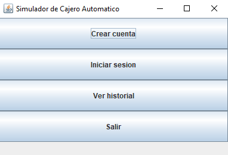

# 💵 Simulador de Cajero Automático en Java

Este proyecto es un simulador de cajero automático desarrollado en Java utilizando `Swing` para la interfaz gráfica. Permite a los usuarios crear cuentas, iniciar sesión, realizar depósitos, retiros, cambiar clave, consultar saldo y visualizar un historial de operaciones con fecha y hora.

---

## 🖼️ Vista previa



---

## 🚀 Funcionalidades

- Crear cuenta con nombre de usuario y clave
- Iniciar sesión con validación
- Consultar saldo
- Realizar depósitos y retiros
- Cambiar clave
- Cerrar sesión con mensaje
- Ver historial de transacciones con fecha y hora

---

## 🛠️ Tecnologías usadas

- Java 8+
- Java Swing (GUI)
- IDE: NetBeans / IntelliJ / Eclipse (recomendado)
- Git para control de versiones

---

## ▶️ Cómo ejecutar

1. Asegúrate de tener Java instalado en tu sistema.
2. Clona este repositorio:
   ```bash
   git clone https://github.com/TU_USUARIO/TU_REPOSITORIO.git
   ```
3. Compila el proyecto:
   ```bash
   javac CajeroGUI.java Cuenta.java
   ```
4. Ejecuta el programa:
   ```bash
   java CajeroGUI
   ```

---

## 📁 Estructura del proyecto

```
SimuladorCajeroJava/
├── CajeroGUI.java
├── Cuenta.java
├── imagenes/
│   └── Screenshot_1.png
├── README.md
```

---

## 📌 Notas

- El historial se guarda en memoria durante la sesión.
- Puedes expandir el proyecto agregando persistencia con archivos o base de datos.
- Proyecto ideal para practicar lógica de programación orientada a objetos y manejo de GUI en Java.

---

## 🙋 Autor

- 👤 **Adrián Alexander Visurraga Arica**
- 📧 Contacto: adrianalex1780@gmail.com
- 🌐 GitHub: [Tu perfil](https://github.com/El-Visu)

